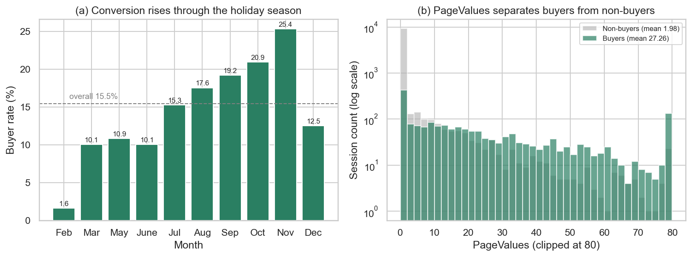
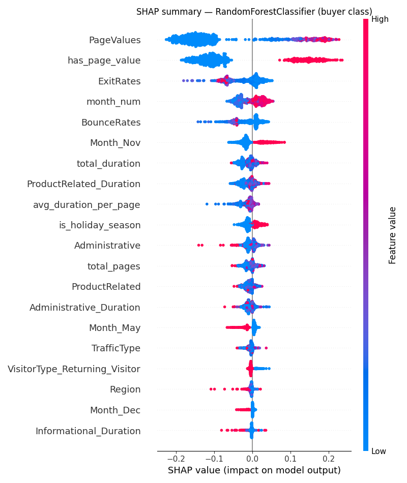
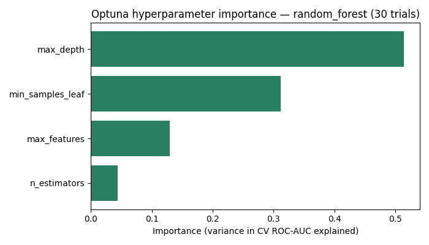

**NOVA Information Management School**
Master in Data Science and Advanced Analytics — Data Science Specialisation

# Predicting online shopper purchase intent: an end-to-end MLOps system

**Course:** Machine Learning Operations — Academic Year 2025/26

**Group members:** [Your Name] – [Student Number] · [Member 2] – [Number] · [Member 3] – [Number]

## 1. Introduction

E-commerce conversion is rare and expensive to influence. In the Online Shoppers Purchasing
Intention dataset [1] (UCI, 12,330 browsing sessions), only 15.5% of sessions end in a
purchase. A retailer that can predict, during a live session, whether a visitor intends to
buy is able to act on that prediction with a targeted discount, a retargeting spend, or a
live-chat prompt, so the model has a clear owner and a measurable cost of error. The aim of
this project is to simulate the full process of deploying and operating such a model: data
validation, a feature store, experiment tracking with model versioning, explainability,
containerised serving, drift monitoring, and automated tests, delivered as a modular,
reproducible pipeline.

The dataset gives 17 features per session. They divide into browsing behaviour (counts and
durations of administrative, informational, and product-related page views), engagement
quality (`BounceRates`, `ExitRates`, and `PageValues`, the average value of pages visited
before a transaction), and context (`Month`, `VisitorType`, `SpecialDay`, `Weekend`). The
target is the binary `Revenue` flag.

The central difficulty is class imbalance. A model that predicts "no purchase" for every
session is 84.5% accurate and operationally useless, so accuracy is rejected as the headline
metric. Model selection optimises ROC-AUC, which is threshold-independent and stable under
imbalance, and the business-facing metric is recall on the buyer class, because the costly
error is failing to flag a buyer and so missing an intervention. A success criterion was
fixed before any modelling: ROC-AUC at least 0.90 and buyer recall at least 0.70. Both were
met (Section 4.2). The engineering target was equally explicit. Every component is a
separately runnable Kedro pipeline, the system reproduces identical results from a pinned
environment, and each of the brief's six requirements is met by a verifiable artifact. Two
extensions, Optuna hyperparameter search and a Kubernetes deployment with autoscaling, are
developed beyond that required surface (Section 6).

## 2. Project planning

The work was scheduled as seven short sprints under an agile method, sequenced by dependency
rather than by requirement number, so each sprint produces a verified artifact the next one
needs. Data quality and the feature store come first, since nothing downstream is
trustworthy without them; modelling and tracking follow; the operational concerns of
serving, drift, and tests come last, because they presuppose a working model. Table 1 gives
the plan with the effort estimated for each sprint.

Table 1: Sprint plan, effort estimate, and outcome.

| Sprint | Focus | Req. | Effort | Outcome |
|---|---|---|---|---|
| 0 | Scaffold, raw data, EDA | — | ~1 day | Kedro project; data in `01_raw`; EDA notebook |
| 1 | Data quality, feature store | #1 | ~2 days | GX gate (8 expectations); local parquet store |
| 2 | Clean, split, select, train | #2, #3 | ~3 days | MLflow tracking and registry; SHAP |
| 3 | Serving, containers | #4 | ~2 days | FastAPI service in a Docker image |
| 4 | Data drift | #5 | ~1 day | Evidently seasonal drift report |
| 5 | Tests, orchestration | #6 | ~2 days | 24 tests; all pipelines runnable in isolation |
| 6 | Report, extensions | — | ~3 days | This report; Optuna and Kubernetes |

Each sprint ran the same loop: implement, run and verify, test, commit. This surfaced
integration faults early. Sprint 5 exposed that the MLflow-registry model could not be
loaded standalone, which was fixed by exporting a portable on-disk copy while the pipeline
was still fresh. Two scope decisions were taken under the brief's reproducibility
constraint. The cloud feature store (Hopsworks) was deferred in favour of a local parquet
store, so the project runs offline for any grader; and Spark was kept out of scope for a
single-machine proof of concept, with its place in a scaled deployment costed in Section 5.
The extensions were scheduled last, after the nine required pipelines and the report were
complete, so they could only raise the ceiling and never threaten the reproducible core.

## 3. Methodology

The project is built as nine modular Kedro pipelines (Appendix B) on the Kedro data-layer
convention. Each runs on its own with `kedro run --pipeline=<name>` or as one chain, and
every dataset passes through the Kedro catalog, so no node carries a hardcoded path. That
modularity is what lets the system be graded component by component and reproduced as a
whole.

### 3.1 Data quality and the feature store

Raw data is not trusted implicitly. The `data_quality` pipeline defines a Great Expectations
suite of eight expectations, covering column presence, the buyer-ratio sanity range, value
bounds on the rate features, and the closed value sets for `Month` and `VisitorType`. A gate
node halts the pipeline on any violation, so bad data fails fast rather than corrupting a
model silently.

Validated features are written by `data_feat_engineering` and `feature_store` into a local
parquet feature store of three groups: numerical, categorical, and target. Keeping the store
local rather than in Hopsworks was a deliberate choice. A hard cloud dependency would break
the reproducibility the brief requires, because a grader could not run the project without
credentials; the local store still satisfies feature versioning while keeping the project
offline-reproducible, and the cloud path is documented as optional. Feature engineering runs
per row, before the split, so it cannot leak. It adds `is_holiday_season`, `total_pages`,
`total_duration`, `avg_duration_per_page`, `has_page_value`, and `product_depth_bin`, all
motivated by the exploration in Section 4.1.

### 3.2 Cleaning, splitting, and leakage control

`data_cleaning` one-hot encodes `Month` and `VisitorType` and casts booleans to integers,
giving a 33-feature model-input table. `data_split` makes a stratified 80/20 train-test
split at a fixed seed, holding the 15.5% buyer ratio in both folds so the minority class is
represented identically.

Leakage is controlled structurally. Per-row transforms (one-hot encoding, arithmetic
features) are safe before the split. The only learned transform, feature scaling, is wrapped
inside a scikit-learn `Pipeline` with the classifier, so the scaler is fitted on the
training fold alone. The test set stays sealed: cross-validation on the training set is the
validation mechanism, and the held-out test set is evaluated exactly once (Section 4.2).
Bundling the scaler inside the model also removes training-serving skew, because the serving
layer cannot forget to scale when scaling is part of the model.

### 3.3 Model selection, training, and tracking

`model_selection` compares Logistic Regression, Random Forest, and Gradient Boosting by
5-fold stratified cross-validated ROC-AUC on the training set only. Imbalance is handled with
`class_weight='balanced'` rather than synthetic oversampling, which keeps the procedure
deterministic and reproducible. The pipeline returns only the champion's name and
configuration, not a fitted model, so that `model_train` can do the final fit with a
train-only scaler and preserve the leakage control of Section 3.2.

`model_train` fits the champion, evaluates it once on the sealed test set, and records
parameters, metrics, and the model to MLflow through `kedro-mlflow` autolog. The champion is
registered as `online_shoppers_champion`, and each re-run creates a new version
automatically; the registry reached version 5 across development runs, which demonstrates the
versioning requirement. A second, portable copy of the model, a plain directory with no
absolute paths, is what the serving layer and the batch-inference pipeline load, which is
what makes the model runnable in a container or a fresh clone (Section 5).

## 4. Evaluation and explainability

### 4.1 Data exploration

Two findings from the exploratory analysis (notebook `01_eda.ipynb`) shaped the modelling and
are shown in Figure 1. Conversion is strongly seasonal: the buyer rate climbs from 1.6% in
February to 25.4% in November against a 15.5% average, a real recurring shift that later
becomes the basis of the drift study (Section 4.4) instead of synthetic noise. And
`PageValues` separates the classes cleanly: buyers average 27.26 against 1.98 for non-buyers,
a 14-fold gap that makes it the strongest single predictor and foreshadows the SHAP ranking
(Section 4.3). New visitors also convert higher, at 24.9% against 13.9% for returning
visitors.

{ width=5.4in }

Figure 1: EDA overview. (a) Buyer rate by month rises from 1.6% (February) to 25.4%
(November), the seasonal swing that motivates the drift study. (b) `PageValues` distribution
by outcome (log count): buyers sit far to the right of non-buyers, confirming it as the
dominant predictor.

### 4.2 Model performance

Table 2 reports the cross-validated selection. Random Forest and Gradient Boosting are close;
Random Forest is chosen on the marginally higher CV ROC-AUC.

Table 2: Cross-validated model selection (5-fold stratified ROC-AUC, training set only).

| Candidate | CV ROC-AUC |
|---|---|
| Logistic Regression | 0.9086 |
| Gradient Boosting | 0.9309 |
| Random Forest (champion) | 0.9316 |

Table 3 gives the champion's held-out test performance, computed once on the sealed 20% test
set.

Table 3: Champion (Random Forest) test-set performance.

| Metric | Value |
|---|---|
| ROC-AUC | 0.927 |
| Recall (buyers) | 0.730 |
| Precision (buyers) | 0.612 |
| F1 (buyers) | 0.666 |
| Accuracy | 0.886 |

The test ROC-AUC of 0.927 sits within 0.005 of the cross-validated 0.9316, which indicates
no overfitting: the model generalises to unseen sessions about as well as it did in
cross-validation. Both pre-registered targets are met, with the model recovering 73% of true
buyers against a 15.5% base rate at a precision usable for a low-cost intervention. The
choice of recall over accuracy is vindicated here, since an accuracy-optimised model would
have suppressed the very minority class the task exists to find.

### 4.3 Explainability with SHAP

A model a business cannot interpret is one it will not act on. `model_train` produces a SHAP
summary plot (Figure 2) using `TreeExplainer`, chosen by model family for roughly a
thousand-fold speed-up over the model-agnostic permutation explainer. SHAP ranks `PageValues`
first, consistent with its 14-fold buyer separation from Section 4.1. The engineered features
earn their place: `has_page_value` ranks second and the seasonal features rank highly, which
is direct evidence that the feature engineering of Section 3.1 added real predictive signal
rather than noise.

{ width=4.3in }

Figure 2: SHAP summary plot for the champion (buyer class). Horizontal position is each
feature's contribution to buyer probability. `PageValues` dominates, with the engineered
`has_page_value` and the seasonal features next.

### 4.4 Data drift monitoring

A model trained across all months degrades silently if the live traffic mix shifts. Rather
than inject synthetic noise, the `data_drift` pipeline uses the dataset's own seasonality as a
genuine drift scenario: an Evidently `DataDriftPreset` compares a low-season reference batch
(`is_holiday_season == 0`) against the holiday-rush current batch (`is_holiday_season == 1`).
The per-column `drift_result.csv` reports 10 of 22 feature columns drifted, a drift share of
0.45. The largest shifts are in `SpecialDay` (0.41 normalised Wasserstein distance), in
browsing depth and duration (`ProductRelated`, `total_pages`, `total_duration`), and, most
consequentially, in `PageValues` (0.11). Because `PageValues` is the model's most important
feature (Section 4.3), this is a clear case of silent degradation: the seasonal distribution
diverges exactly where the model is most sensitive. The pipeline emits a visual HTML report
(Figure 3) and the machine-readable CSV, so the check is ready to drive an automated
retraining trigger (Section 7).

Figure 3: [Insert a screenshot of `data/08_reporting/data_drift_report.html`.] Evidently
report comparing the low-season reference and the holiday-rush batch, with the drifted
columns flagged.

## 5. Serving and production readiness

The champion is served by a FastAPI application exposing `/predict`, `/health` for liveness,
and `/ready` for readiness, the last of which returns the 33-column feature schema. It loads
the portable model directory of Section 3.3, so the same artifact runs identically in a clone
or a container. The `model_predict` pipeline and the API share one feature contract, so
training and serving cannot diverge, and `/predict` reproduces the pipeline exactly. The
service ships as a non-root `python:3.12-slim` Docker image with a `HEALTHCHECK`, and was
verified end to end: `/health` returns 200, `/ready` returns the schema, `/predict` matches
the pipeline, and an unknown feature column returns HTTP 422.

This system is a proof of concept, so several shortcuts were taken deliberately to keep it
reproducible. Table 4 lists the main risks, the mitigation, and a rough effort to close each
in a real deployment.

Table 4: Production risks, mitigations, and estimated effort to productionise.

| Risk | Mitigation | Effort |
|---|---|---|
| Pandas will not scale past single-machine memory | The Kedro catalog abstracts I/O, so swapping `pandas.ParquetDataset` for `spark.SparkDataset` is a config change, not a rewrite | +2 to 3 weeks to port to Spark and re-validate |
| Seasonal drift degrades accuracy silently (Section 4.4) | The `data_drift` CSV becomes a scheduled retraining trigger | +1 to 2 weeks to wire drift into CI/CD |
| No live monitoring of prediction quality | MLflow-logged production metrics plus a dashboard; the surface already exists | +1 week for a serving-metrics dashboard |
| Training-serving skew | One shared feature schema plus the scaler bundled inside the model | mitigated by design |

## 6. Creative extensions

Both extensions are isolated and optional: the nine required pipelines run identically with or
without them, so reproducibility is never compromised.

### 6.1 Optuna hyperparameter search

The required path fixes the champion's hyperparameters; the `model_optimisation` pipeline
tunes them. It uses Optuna's TPE sampler [2], a Bayesian search that is more sample-efficient
than grid search, over 30 seeded trials, optimising the same cross-validated ROC-AUC on the
training set only, so the reported gain carries no leakage. The tuned configuration is
`n_estimators=400, max_depth=14, min_samples_leaf=7, max_features=sqrt`.

Table 5: Optuna result (Random Forest, 30 TPE trials, CV ROC-AUC on the training set).

| | Baseline (fixed) | Optuna-tuned |
|---|---|---|
| CV ROC-AUC | 0.9316 | 0.9347 |

{ width=4.1in }

Figure 4: Optuna hyperparameter importance for the champion. Tree depth (0.51) dominates,
ahead of `min_samples_leaf` (0.31), `max_features` (0.13), and `n_estimators` (0.04).

The gain is real but small, at +0.0031 ROC-AUC. The honest reading is that the binding
constraint is signal saturation rather than hyperparameters: a Random Forest with sensible
defaults already captures most of the structure `PageValues` exposes, so tuning refines the
model instead of transforming it. The importance ranking is the durable result. Tree depth
governs the model's capacity to combine `PageValues` with secondary features, which is why it
accounts for over half the outcome variance across trials. The tuned configuration plugs into
`model_train` unchanged.

### 6.2 Kubernetes deployment with autoscaling

The Docker image alone satisfies the serving requirement; Kubernetes adds replication,
health-gated traffic, and elastic capacity. Three manifests in `serving/k8s/` define a
Deployment of two replicas with liveness and readiness probes and CPU requests, a NodePort
Service that load-balances across them, and a HorizontalPodAutoscaler that scales from 2 to 6
replicas at a 60% average-CPU target. The autoscaler is motivated by the seasonal traffic
spikes the drift study reveals (Section 4.4). The deployment was validated live on Docker
Desktop: both pods reached `Ready`, the Service served `/predict` through NodePort 30080
(buyer probability about 0.32), and with a metrics-server installed the HPA reported real CPU
usage at 5% against the 60% target, confirming the autoscaling loop was active. The captured
output is in `serving/k8s/deployment_evidence.txt`.

## 7. Conclusion

This project delivers an end-to-end MLOps system that meets all six requirements with
separately runnable, reproducible components. The Random Forest champion reaches a test
ROC-AUC of 0.927 and recovers 73% of true buyers, meeting both pre-registered targets with no
overfitting, and SHAP confirms `PageValues` as the dominant driver with the engineered
features adding real signal. The seasonal drift study flags 10 of 22 features drifting between
seasons, including the most important one, which makes silent degradation concrete. The model
is served behind FastAPI and Docker and was deployed live to Kubernetes with working CPU
autoscaling, while Optuna search produced a small gain that, read honestly, points to signal
saturation rather than a tuning deficit.

Several limitations remain. The model is trained on one static dataset with a single random
seed, which precludes confidence intervals on the headline metrics. The drift study compares
two seasonal slices of the same historical data rather than a true future batch, so it
demonstrates the mechanism of detection rather than a live production shift. The feature store
is local parquet, where a multi-team setting would want a shared versioned store, and the
Kubernetes autoscaling was checked under low synthetic load rather than a real traffic spike.
Future work follows from these: wire the drift CSV into an automated retraining trigger,
load-test the autoscaler to observe a real scale-up, migrate the feature I/O to Spark to test
the scaling mitigation in practice, and calibrate the decision threshold to the retailer's
intervention cost.

## References

[1] C. O. Sakar, S. O. Polat, M. Katircioglu, and Y. Kastro, "Real-time prediction of online
shoppers' purchasing intention using multilayer perceptron and LSTM recurrent neural
networks," *Neural Computing and Applications*, vol. 31, no. 10, pp. 6893–6908, 2019. Dataset:
UCI Machine Learning Repository.

[2] T. Akiba, S. Sano, T. Yanase, T. Ohta, and M. Koyama, "Optuna: A next-generation
hyperparameter optimization framework," in *Proc. 25th ACM SIGKDD Int. Conf. on Knowledge
Discovery and Data Mining*, 2019, pp. 2623–2631.

[3] S. M. Lundberg and S.-I. Lee, "A unified approach to interpreting model predictions," in
*Advances in Neural Information Processing Systems*, vol. 30, 2017.

## Appendix A: Package versions

Reproduce with `uv pip install -r requirements.txt && kedro run`. A clean-environment install
was verified to reproduce the pipeline results exactly; for example `model_predict` scores
2,466 test rows and predicts 456 buyers.

| Package | Version | Package | Version |
|---|---|---|---|
| kedro | 1.3.1 | shap | 0.52.0 |
| kedro-mlflow | 2.0.2 | evidently | 0.7.21 |
| mlflow | 3.11.1 | great-expectations | 1.16.1 |
| scikit-learn | 1.5.2 | optuna | 4.8.0 |
| pandas | 2.3.3 | fastapi | 0.136.0 |
| numpy | 2.3.5 | uvicorn | 0.44.0 |

## Appendix B: Pipeline catalogue

The nine required pipelines, each runnable with `kedro run --pipeline=<name>`, plus the
optional Optuna extension.

| Pipeline | Req. | Role |
|---|---|---|
| `data_quality` | #1 | Great Expectations gate (8 expectations); halts on bad data |
| `data_feat_engineering` | #1 | Per-row behavioural and temporal features (no leakage) |
| `feature_store` | #1 | Persists feature groups to local parquet |
| `data_cleaning` | — | Encode and clean into the 33-feature model input |
| `data_split` | — | Stratified train-test split; test sealed until final eval |
| `model_selection` | — | Cross-validated champion selection on ROC-AUC |
| `model_train` | #2, #3 | Train, MLflow tracking and registry, SHAP |
| `model_predict` | — | Batch inference on the sealed test set |
| `data_drift` | #5 | Evidently seasonal drift report (HTML and CSV) |
| `model_optimisation` | ext. | Optuna search for the champion (optional, isolated) |

Tests for requirement #6: 24 pytest tests cover the cleaning, split, predict, drift, and
optimisation nodes, plus a registry test asserting that all nine required pipelines are
registered and independently runnable.
